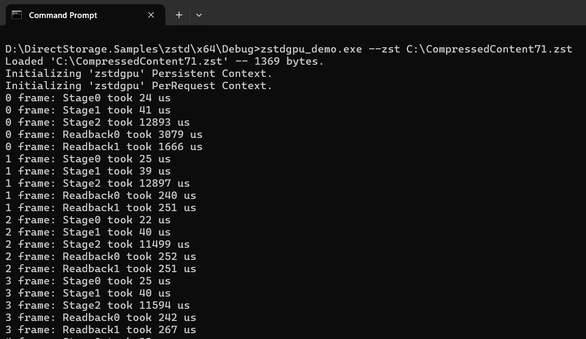

# ZStandard (zstd)
ZStandard is a fast lossless compression algorithm,
targeting real-time compression scenarios at zlib-level and better compression ratios. Zstandard's format is stable and documented in [RFC8878](https://datatracker.ietf.org/doc/html/rfc8878).

Source code for the zstd cpu compressor and decompressor can be found on the [zstd github Repository Page](https://github.com/facebook/zstd)

# ZSTD decompression shaders
This sample includes reference implementations of shaders that are designed to perform zstd decompression using a GPU.  These shaders are all authored in HLSL and support a wide variety of GPUs.

<span style="color:red;font-size:20px; font-weight:bold;">
This code is currently in development and should NOT be used in production environments or for released products.</span>

Once development has been completed and the shader meets production quality standards, the sample code will be moved into the MAIN branch.

Versions of these same shaders are also included/compiled inside the DirectStorage runtime to be used as a fallback for GPUs that do not have optimized zstd GPU decompression driver support.  Most game ready GPU drivers will come with their own optimized decompression support which is faster and more efficient than this implementation.




# Build
Install latest [Visual Studio](http://www.visualstudio.com/downloads).

Open the following Visual Studio solution and build
```
zstd\zstd.sln
```

# Usage
Example usage
```
zstd\x64\Debug\zstdgpu_demo.exe --zst <file to decompress>>
```

## Related links
* https://aka.ms/directstorage
* [DirectX Landing Page](https://devblogs.microsoft.com/directx/landing-page/)
* [Discord server](http://discord.gg/directx)
* [PIX on Windows](https://devblogs.microsoft.com/pix/documentation/)

